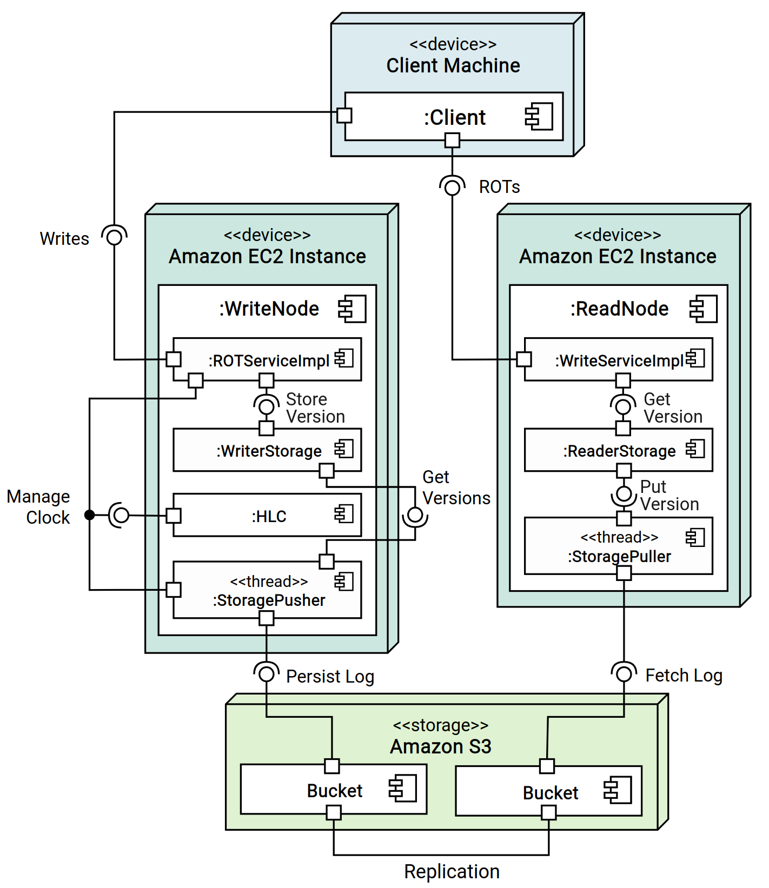

# Dissertation Work
A prototype implementation of a cloud-native causally consistent system. 

## Description
This repository holds a prototype implementation of a cloud-native causally consistent read-heavy system. It represents part of the work developed for my Master's dissertation and aimed to study the feasibility of the proposed reference architecture and identify any impediments and possible improvements in its design.

This repository also holds a prototype version where clients issue requests directly to the underlying storage service, serving as a baseline for comparison with the causally consistent prototype. Finally, it contains the necessary scripts to test the prototype in AWS, the scripts used for the evaluation, and the plots and tables that resulted from our analysis. Finally, it also comprises a short experiment that aims to demonstrate how the system can be easily audited through its logs.

> For a more detailed description of the prototype, please refer to the [Prototype System section](#prototype-system).

## Structure

This repository holds:
1. The prototype system
2. The baseline version
3. The validation source code, logs, results and instructions
4. An experiment that aims to verify the usefulness of value semantics for auditing 

### 1. Prototype
A Maven project with the following structure:

`src/main` comprises the project's source code and follows the structure below:
- `java/com/dissertation`:
    - `referencearchitecture`: Comprises the classes that implement the candidate reference architecture.
        - `client`: Contains the `Client` class, which can be used to issue ROTs and write operations. It connects with the `ReadNode` of its region and with the `WriteNodes` of its region's partitions through gRPC. It keeps a "cache" with its unstable writes and his last write timestamp.
        - `compute`: Contains the `ReadNode` and `WriteNode`, respectively responsible for handling ROTs of a region and writes of a partition. Also contains the `storage` package, which comprises the classes used to store the log in-memory and to pull and push the log to the data store. Furthermore, it stores the classes related to the implementation of the Hybrid Logical Clock in the `clock` package.
        - `s3`: Provides the necessary functions to perform put and get operations in AWS S3.
    - `utils`: Util functions, constants and classes.
    - `evaluation`: Comprises classes that can be used to evaluate the prototype:
        - `logs`: Classes that represent logs of each relevant operation. Used for validating the prototype.
        - `singleClient`:
            - `ClientInterface`: To test the prototype through a command-line interface.
            - `BusyReadGenerator`: A single-threaded reader that issues read requests with no delay to the keys provided in the arguments.
            - `ConstantWriteGenerator`: A single-threaded writer that issues a configurable number of write requests at a fixed rate, alternating between the provided set of keys.
            - `ConstantReadGenerator`: A single-threaded reader that issues read requests with a fixed delay to all the keys provided in the arguments for the given amount of time.
            - `BusyWriteGenerator`: A single-threaded writer that issues write requests with no delay, alternating between the provided set of keys.
        - `multiClient`:
            - `BusyReadGenerator`: A multi-threaded reader that uses a client instance per thread to issue read requests with no delay.
            - `ConstantWriteGenerator`: A multi-threaded writer that uses a client instance per thread to issue write requests at a fixed rate.
            - `ConstantReadGenerator`: A multi-threaded reader that uses a client instance per thread to issue read requests with a fixed delay for the given amount of time.
            - `BusyWriteGenerator`: A multi-threaded writer that  uses a client instance per thread to issue write requests with no delay.
- `proto`: Holds the Protocol Buffers file that defines the services provided by read and write nodes.

### 2. Baseline
For comparison with our causally consistent prototype, which uses S3 as the storage layer, we developed a baseline version where clients issue read and write requests directly to S3. It consists of a Maven project with the following structure:

`eventual/src/main/java/com/dissertation`:
- `eventual`: Comprises the classes that implement the eventually consistent baseline
    - `client`: Contains the `Client` class, which can be used to issue read and write operations to S3.
    - `s3`: Provides the necessary functions to perform put and get operations in AWS S3.
    - `utils`: Util functions, constants and classes.
- `evaluation`: Comprises classes that can be used to evaluate the baseline:
    - `logs`: Classes that represent logs of each relevant operation. Used for validating the baseline.
    - `ClientInterface`: To test the prototype through a command-line interface.
    - `BusyReadGenerator`: A single-threaded reader that issues read requests with no delay to the keys provided in the arguments.
    - `ConstantWriteGenerator`: A single-threaded writer that issues a configurable number of write requests at a fixed rate, alternating between the provided set of keys.
    - `ConstantReadGenerator`: A single-threaded reader that issues read requests with a fixed delay to all the keys provided in the arguments for the given amount of time.
    - `BusyWriteGenerator`: A single-threaded writer that issues write requests with no delay, alternating between the provided set of keys.

### 3. Evaluation
Holds the scripts that were used to evaluate the prototype in AWS and the source code that was used to perform the evaluation. It also holds the logs and results of the evaluation.

`evaluation`:
- `logs`: Stores the evaluation logs generated when running the evaluation scripts in AWS.
- `results`: Stores the plots and other results of the analysis of the logs. The `single_client` directory stores the results from the evaluation performed with the single-client load generators while the `multi_client` directory stores the results from the multi-client load generators.
- `aws-scripts`: Holds useful scripts for running each component of the prototype with docker and to generate the logs.
- `data_analysis`: A python package to analyze the logs generated during the evaluation and generate the necessary plots and tables.
- `README.md`: Describes the tests performed during the evaluation and includes the necessary commands to replicate them.

### 4. Value Semantics Experiment
Source code and logs used to demonstrate how enabling value semantics facilitates auditing.

`value_semantics`:
- `logs`: The logs used to perform the experiment.
- `__main__.py`: A python script that, given a set of keys and a timestamp/data-time can retrieve from the logs the value of the keys at that time or the history of a key up until that time.
- `REAME.md`: Describes the configuration used to obtain the logs and perform the experiment and the commands that can be used to replicate it.

## Dependencies
### To test locally
- [LocalStack CLI](https://docs.localstack.cloud/getting-started/installation/) and [AWS Command Line Interface](https://docs.localstack.cloud/user-guide/integrations/aws-cli/).
- OpenJDK
- Maven
- make *(optional)*
- python, matplotlib, seaborn, re, pandas, numpy *(for the validation and value semantics experiment)*

### To test in AWS
- EC2 instances must have docker installed, expose port 8080 and have access to S3 buckets.
- S3 buckets for each partition.

## Execution Instructions
In this section, we provide instructions for testing the prototype system and the baseline system either locally using LocalStack or in AWS.

> If you wish to replicate the validation performed in our dissertation, **please read the instructions below on how to set up the components in AWS** and then refer to the README in the [evaluation directory](./evaluation/README.md) or to the README of the [value_semantics directory](./value_semantics/README.md).

### AWS

#### 1. Build the Docker Images / Use the provided Docker images
For deploying the systems in AWS, we built the following docker images:
1. `dianaamfreitas/dissertation` for the prototype system
2. `dianaamfreitas/dissertation-eventual` for the baseline system

The images supports linux/amd64 and linux/arm64 and our tests were performed using Ubuntu 22.04 LTS arm64.

For the prototype, we built several image versions: 
1. `dianaamfreitas/dissertation:final` Without checkpointing, to evaluate latency and throughput or use the command-line interface.
2. `dianaamfreitas/dissertation:final-goodput` Without checkpointing, to evaluate goodput.
3. `dianaamfreitas/dissertation:final-visibility` Without checkpointing, to evaluate visibility.
4. `dianaamfreitas/dissertation:final-checkpointing` With checkpointing/garbage collection of the nodes storage.

For the baseline we have only one: `dissertation-eventual:final`

If you wish to build you own docker images instead you can also choose to do that. How?
1. For the prototype system, you can run: 
    1. `docker buildx build --platform linux/amd64,linux/arm64 -t <imageName>:final --build-arg visibility_logs=false --build-arg goodput_logs=false --build-arg checkpointing=false --build-arg log_delay=5000 --push .`
    2. `docker buildx build --platform linux/amd64,linux/arm64 -t <imageName>:final-goodput --build-arg visibility_logs=false --build-arg goodput_logs=true --build-arg checkpointing=false --build-arg log_delay=5000 --push .`
    3. `docker buildx build --platform linux/amd64,linux/arm64 -t <imageName>:final-visibility --build-arg visibility_logs=true --build-arg goodput_logs=false --build-arg checkpointing=false --build-arg log_delay=5000 --push .`
    4. `docker buildx build --platform linux/amd64,linux/arm64 -t <imageName>:final-checkpointing --build-arg visibility_logs=false --build-arg goodput_logs=false --build-arg checkpointing=true --build-arg log_delay=5000 --push .`
2. For the baseline, please move to the `eventual` directory and use the following command:
`docker buildx build --platform linux/amd64,linux/arm64 -t <imageName>:final --push .`
3. Update the image name in the scripts of the [aws_scripts directory](./evaluation/aws_scripts/).

#### 2. Deploy Prototype
1. Create an EC2 instance for each system component (read and write nodes and cli or load generators) setting the user data to the contents of `docker-install.sh`, which installs docker on the instance. Make sure to set the security group's inbound rules so that port 8080 accepts TCP requests from the client instances.
2. Set the IAM Role of read and write nodes' instances to enable access to S3 buckets.
3. Update the `BUCKET_SUFFIX` of each component's script in [aws_scripts directory ](./evaluation/aws_scripts/). 
4. Setup the buckets using the `BUCKET_SUFFIX` defined above (e.g. the bucket of partition 1 must be named p1-region`BUCKET_SUFFIX`, and the clock bucket must be named clock`BUCKET_SUFFIX`). Setup the replication between buckets.
5. Connect to each instance and upload the desired scripts into each instance
6. Run the read and write nodes:
    - **Read Node**: `./readNode.sh <imageTag> <totalPartitions> <port> <regionPartitionsIds>`
    - **Write Node**: `./writeNode.sh <imageTag> <totalPartitions> <port> <partitionId> (<readPort> <readIp>)+`
7. Run the CLI or the load generators:
    - **CLI**: `./cli.sh <imageTag> <totalPartitions> <readPort> <readIP> (<writePort> <writeIP> <partitionId>)+`
    - **Single-client generators** (a single client issues read requests and another write requests):
        1. Read in a closed loop and write at a constant rate:
            - **BusyReadGenerator**: `./busyReadGenerator.sh <imageTag> <totalPartitions> <regionPartitions> <readPort> <readIP> (<writePort> <writeIP> <partitionId>)+ <expectedWrites> <keysPerRead> <key>+` 
            - **ConstantWriteGenerator**: `./constantWriteGenerator.sh <imageTag> <totalPartitions> <regionPartitions> <readPort> <readIP> (<writePort> <writeIP> <partitionId>)+ <delay> <totalWrites> <key>+`
        2. Write in closed loop and read at a constant rate:
            - **BusyWriteGenerator**: `./busyWriteGenerator.sh <imageTag> <totalPartitions> <regionPartitions> <readPort> <readIP> (<writePort> <writeIP> <partitionId>)+ <key>+`
            - **ConstantReadGenerator**: `./constantReadGenerator.sh <imageTag> <totalPartitions> <regionPartitions> <readPort> <readIP> (<writePort> <writeIP> <partitionId>)+ <readDelay> <readTime> <keysPerRead> <key>+`
    - **Multi-client generators** (multiple clients issue ROTs and several others issue write requests): 
        1. Read in a closed loop and write at a constant rate:
            - **BusyReadGenerator**: `./multiBusyReadGenerator.sh <imageTag> <totalPartitions> <regionReadNodes> <regionPartitions> <readPort> <readIP> (<writePort> <writeIP> <partitionId>)+ <readTime> <keysPerRead> <keysPerPartition> <readClients>`
            - **ConstantWriteGenerator**: `./multiConstantWriteGenerator.sh <imageTag> <totalPartitions> <regionPartitions> <readPort> <readIP> (<writePort> <writeIP> <partitionId>)+ <delay> <writesPerClient> <keysPerPartition> <writeClients>`
        2. Write in closed loop and read at a constant rate:
            - **BusyWriteGenerator**: 
            `./multiBusyWriteGenerator.sh <imageTag> <totalPartitions> <regionPartitions> <readPort> <readIP> (<writePort> <writeIP> <partitionId>)+ <keysPerPartition> <writeClients>`
            - **ConstantReadGenerator**: 
            `./multiConstantReadGenerator.sh <imageTag> <totalPartitions> <regionPartitions> <readPort> <readIP> (<writePort> <writeIP> <partitionId>)+ <readDelay> <readTime> <keysPerRead> <keyPerPartition> <readClients>`

#### 3. Deploy Baseline
1. Create an EC2 instance for each client, setting the user data to the contents of `docker-install.sh`, which installs docker on the instance. Make sure to set the security group's inbound rules so that port 8080 accepts TCP requests from the client instances.
2. Set the IAM Role of these instances to enable access to S3 buckets.
3. Update the `BUCKET_SUFFIX` of each component's script in [aws_scripts directory ](./evaluation/aws_scripts/). 
4. Setup the buckets using the `BUCKET_SUFFIX` defined above (e.g. the bucket of partition 1 must be named p1-region`BUCKET_SUFFIX`). Setup the replication between buckets.
5. Connect to each instance and upload the desired scripts into each instance
6. Run the CLI or the load generators:
    - **Cli**: `./evCli.sh <imageTag> <totalPartitions>`
    - **Load generators**: 
        1. Read in a closed loop and write at a constant rate
            - **BusyReadGenerator**: `./evBusyReadGenerator.sh <imageTag> <totalPartitions> <expectedWrites> <key>+`
            - **ConstantWriteGenerator**: `./evConstantWriteGenerator.sh <imageTag> <totalPartitions> <delay> <totalWrites> <key>+`
        2. Write in closed loop and read at a constant rate
            - **BusyWriteGenerator**: `./evBusyWriteGenerator.sh <imageTag> <totalPartitions> <key>+`
            - **ConstantReadGenerator**: `./evConstantReadGenerator.sh <imageTag> <totalPartitions> <readDelay> <readTime> <key>+`

### LocalStack (locally)
The project can be tested locally using LocalStack.

> For simplicity we provide some predefined commands in the `Makefile` of the root folder to test the prototype and also in the `Makefile` of the `eventual` folder to test the baseline. We refer to some of these commands as an example.

#### Prototype
**Setup S3 buckets and servers**:
1. Open a terminal and start LocalStack: `localstack start` 
2. Open a new terminal in the root folder
3. Build the project: `make` / `mvn package`
4. Create the buckets:
    a. For each partition: `awslocal s3api create-bucket --bucket p<partitionId>-<region><suffix> --region <region>`
    b. For the clock values: `awslocal s3api create-bucket --bucket clock-<suffix> --region <region>`
    > e.g. `make createBuckets` creates the buckets for partitions 1 and 2 and for the clock values using the suffix `-reference-architecture`.

6. Start the read nodes, specifying:
    - the log push/pull delay (`<logDelay>`);
    - if checkpointing is enabled or disabled (`<checkpointing>`);
    - the total number of partitions in the system (`<nPartitions>`);
    - the suffix used in the buckets (`<suffix>`);
    - the port (`<readPort>`);
    - the ids of the partitions that the read node keeps a copy of (`<partitionId>*`).

    `java -Ds3Endpoint=http://localhost:4566 -DlogDelay=<logDelay> -Dcheckpointing=<checkpointing> -Dpartitions=<nPartitions> -DbucketSuffix=<suffix> -jar target/readNode.jar <readPort> <partitionId>*`
    > e.g. `make readNode` creates a read node that tracks partitions 1 and 2.

7. Start the write nodes, specifying:
    - the log push/pull delay (`<logDelay>`);
    - if checkpointing is enabled or disabled (`<checkpointing>`);
    - the total number of partitions in the system (`<nPartitions>`);
    - the suffix used in the buckets (`<suffix>`);
    - the id of the partition that the write node is responsible for (`<partitionId>`);
    - the port (`<writePort>`)
    - the read nodes that track his partition (`<<readPort> <readIp>>*`)

    `java -Ds3Endpoint=http://localhost:4566 -DlogDelay=<logDelay> -Dcheckpointing=<checkpointing> -Dpartitions=<nPartitions> -DbucketSuffix=<suffix> -jar target/writeNode.jar <partitionId> <writePort> <<readPort> <readIp>>*`
    > e.g. `make writeNode1` and `make writeNode2` create the write nodes responsible for partitions 1 and 2, respectively.

**Issue read and write requests**:
Using the command-line interface, you can test the behavior of the prototype locally.
1. Start the desired number of clients:
    `java -DlogDelay=<logDelay> -Dpartitions=<nPartitions> -DbucketSuffix=<suffix> -jar target/clientInterface.jar <readPort> <readIp> (<writePort> <writeIp> <partitionId>)*`
    > e.g. `make client` starts a client.
2. Issue the desired ROT, write or atomic write requests:
    - ROT: `R x y` (reads the values of keys x and y)
    - Write: `W x 3` (writes the value 3 to key x)
    - Atomic write type A: `WA x 3 00000001685206329008-00000000000000000038` (writes the value 3 to key x if the current version of x has the specified timestamp)
    - Atomic write type B: `WB x 3 00000001685206329008-00000000000000000038 4` (writes the value 3 to key x if the current version of x has the specified timestamp and the value 4)
    - Atomic write type C: `WC x 3 4` (writes the value 3 to key x if the current version of x has the value 4)

**Clean the buckets**:
`awslocal s3 rm s3://<bucketName> --recursive`
> e.g. `make emptyBuckets`

#### Baseline
**Setup S3 buckets**:
1. Open a terminal and start LocalStack: `localstack start` 
2. Open a new terminal in the `eventual` folder
3. Build the project: `make`
4. Create the buckets for each partition, always using the same suffix:
    `awslocal s3api create-bucket --bucket p<partitionId>-<region><suffix> --region <region>`
    > e.g. `make createBuckets` creates the buckets for partitions 1 and 2.

**Issue read and write requests**:
Using the command-line interface, you can test the behavior of the baseline locally.
1. Start the desired number of clients:
    `java -Ds3Endpoint=http://localhost:4566 -Dpartitions=<nPartitions> -DbucketSuffix=<suffix> -jar target/clientInterface.jar`
    > e.g. `make client`
2. Issue the desired read and write requests:
    - Read: `R x` (reads the value of key x)
    - Write: `W x 3` (writes the value 3 to key x)

**Clean the buckets**:
`awslocal s3 rm s3://<bucketName> --recursive`
> e.g. `make emptyBuckets`

## Prototype System
Candidate Reference Architecture |  Prototype Architecture
:-------------------------:|:-------------------------:
  |  

### Overview
The system realizes the reference architecture using Amazon S3 as the storage service and Amazon EC2 to deploy the servers (i.e., write and read nodes). The `Client` process works like a client-side library, handling the interaction with the servers and keeping metadata of his previous writes. The `WriteNode` server exposes a `gRPC` service that provides write operations. Write nodes use a Hybrid Logical Clock(`HLC`) to order writes and contain a (`WriterStorage`) for storing the new versions. A `StoragePusher` thread reads the versions from storage, builds the log, and persists it in the Amazon S3 bucket of its partition. S3 handles replication to other buckets replicating that same partition. The `ReadNode` server uses the `StoragePuller` thread to fetch the logs of the partitions it stores from the appropriate buckets. It updates its storage (`ReaderStorage`) and the metadata required to ensure causal consistency. Read nodes expose a `gRPC service` that accepts read-only transactions (ROTs), which are performed from the server’s storage.

### Features
- **Storage Layer**: Amazon S3 Simple Storage Service.
- **Compute Layer**: Read Nodes provide ROTs from the stable frontier whereas Write Nodes provide single-key writes and atomic writes.
- **Client Layer**: Forwards the operations to the appropriate Compute Nodes. Stores the client's writes until they are known to be stable.
- **Communication**: gRPC framework.
- **Clock**: Hybrid Logical Clock.
- **Consistency**: Convergent Causal Consistency w/ ROTs.
- **Clock Synchronization**: Write Nodes asynchronously persists their last clock value in an S3 bucket. In the absence of updates, they fetch the last clock value from other partitions and synchronize if it is higher than their current value.
- **Check-pointing**: Periodically, write nodes replace a prefix of their log with a checkpoint. For that purpose, they get the minimum stable time from the Read Nodes that replicate their partition and only remove versions below the stable frontier established by that time (always keeping the latest stable version of each key).

