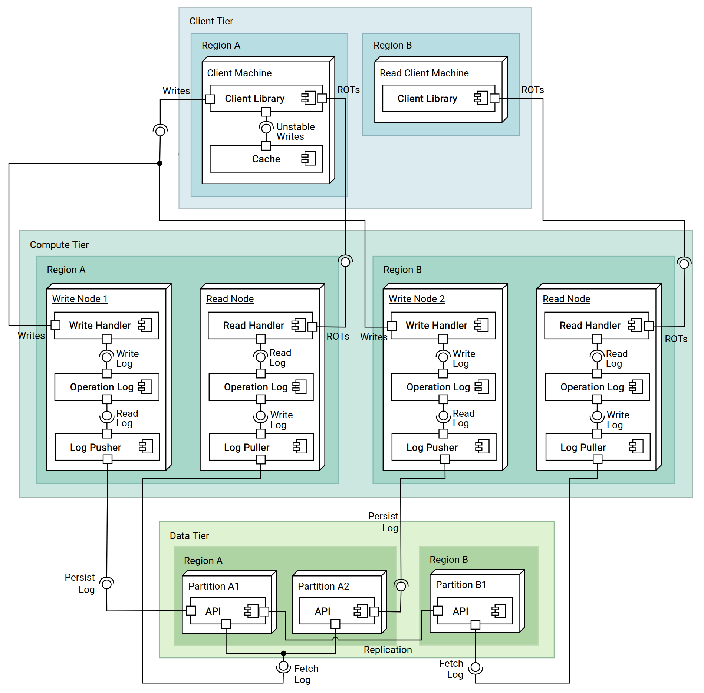

# Dissertation Work

A prototype implementation of a cloud-native causally consistent system. 

## Description

This repository holds an implementation prototype of the candidate reference architecture for a cloud-native causally consistent read-heavy system. With this prototype, we aim to study the feasibility of the candidate reference architecture and identify any impediments and possible improvements at an early stage.

For a more detailed description of the reference architecture please refer to [Reference Architecture](#candidate-reference-architecture).

## Prototype Features
### Current Features
- **ECDS**: Localstack is being used to emulate AWS S3 (without any replication configuration).
- **Compute Layer**: provides ROTs and Writes to the Client via RMI and uses AWS S3 for persistance.
- **Client Layer**: connects with the Compute Layer via RMI.
- **Clock**: Logical Clock.
- **Consistency**: stable time computation, read-you-writes for multiple writers through client cache and last write timestamp for monotonic writes.
- **Clock Synchronization**: Each *Write Compute Node* asynchronously persists his clock value in an S3 bucket and fetches the last clock value that has been stored. If the fetched clock value is higher than it own, it advances its clock.

### Next steps
- Implement and use Hybrid Logical Clocks
- Setup S3 Replication
- Generate Read/Write Load
- Optimize log persistance and fetching
- Improve clock synchronization strategy when S3 replication is in place

## Getting Started

### Structure 
TODO

### Dependencies
*(TODO: setup up docker-compose)*
- [Localstack](https://docs.localstack.cloud/getting-started/installation/)
- OpenJDK
- Maven

### Execution Instructions
1. Open a terminal and start localstack: `localstack start` 
2. Open a new terminal in the root folder
3. Create buckets: `make createBuckets`. This command creates buckets in:
    - us-east-1:
        - bucket "partition1": keys "x" and "y"
        - bucket "partition2": key "z"
        - bucket "clock", which is used to persist the clock values
    - use-west-1:
        - bucket "partition3": key "p"
4. `make`
5. Start the Read Compute Nodes, one on each terminal:
    - `make readNodeWest`
    - `make readNodeEast`
6. Start the Write Compute Nodes, one on each terminal:
    - `make writeNode1` (partition1)
    - `make writeNode2` (partition2)
    - `make writeNode3` (partition3)
7. Start the desired number of Clients:
    - `make clientWest` to access buckets in "us-west-1"
    - `make clientEast` to access buckets in "us-east-1"
8. Issue the desired ROT and write requests:
    - ROT example: `R x y` (keys must be available in the region)
    - Write example: `W x 3` (the value must be an integer)

## Candidate Reference Architecture

**Clock**: 
Logical clock or Hybrid Logical Clock

**Assumptions**: 
- The Eventually consistent Data Store (ECDS) allows writing to a specific region/partition.
- The ECDS allows reading by region, partition and timestamp.
- A *Read Compute Node* in region R must only respond to read requests for partitions stored in region R.
- A *Write Compute Node P* must only perform write requests in partition P. 
- Partitions are disjoint.
- Clients are sticky to a *Read Compute Node* of their region.

**Overview**:
- The Client Layer forwards writes and ROTs to the Compute Layer through a client library. Writes are forwarded to the *Write Compute Node* of the partition that is resposible for the data item that is written. ROTs are forwarded to the *Read Compute Node* of the nearest region.
- The client stores his writes in cache until he knows that they are stable. 
- There is a *Write Compute Node* per partition that orders the writes to that partition, updates the partition’s log and persists it to the ECDS.
- Replication is handled by the ECDS, so the *Write Compute Node* just needs to write each log in one region and the ECDS will replicate it to the others.
- *Read Compute Nodes* read asynchronously and periodically from the ECDS. They must keep track of the *stableTime* (a time below which the compute node knows all writes).
- *Read Compute Nodes* must determine the *stableTime* from which ROTs can be performed. The client must store the timestamp of his last write (*lastWriteTimestamp*) so that it ensures monotonic writes. That timestamp must be sent in the next write request so that the server may update his clock and ensure that the second write is time stamped with a higher version than the first.
- Given that there are multiple writers, clocks must be synchronized to ensure writes become visible.
- When a *Read Compute Node* receives a ROT request, it reads from the *stableTime* and sends back the *stableTime* together with the requested values so that the client may prune his cache and determine which values to return. After pruning the cache, if the client has a version in his cache of one of the requested items, he must return the value in his cache to ensure read-your-writes.

